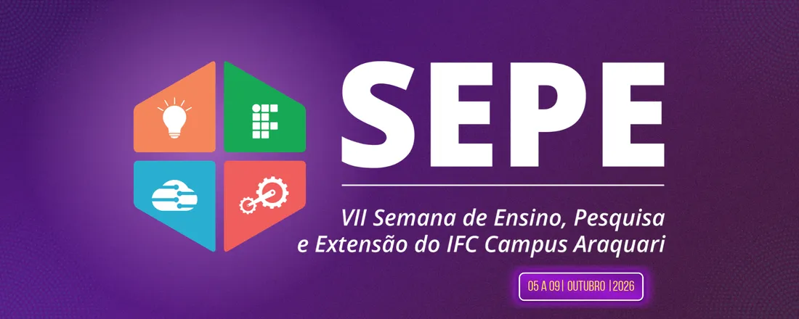

# Minicuro Básico: Oficina de Interfaces Digitais com Figma

Minicurso introdutório de criação de interfaces digitais com Figma, apresentado por Maria Fernanda Caetano.

## Roteiro resumido

1. **Introdução:** conhecer a proposta da oficina e abrir os materiais.
2. **Interface do Figma:** explorar canvas, frames, camadas e painel de propriedades.
3. **Atalhos e navegação:** selecionar elementos, ajustar zoom, movimentar o canvas e conferir espaçamentos.
4. **Ferramentas fundamentais:** criar textos, formas, linhas, cores, bordas e cantos arredondados.
5. **Exemplo Pulse:** montar uma landing page com cabeçalho, título, descrição, botão e card de impacto.
6. **Atividade prática:** criar uma tela de divulgação da oficina do zero.
7. **Design e revisão:** aplicar hierarquia visual, espaçamento, contraste, consistência e legibilidade.
8. **Prototipagem:** conectar o botão a uma segunda tela para demonstrar uma interação simples.

## Materiais

- [Apostila do minicurso](Minicurso-Figma-Apostila.pdf)
- [Slides do minicurso](Minicurso-Figma-Slides.pdf)
- [Exemplo guiado da Pulse no Figma](https://www.figma.com/design/DQiHEwg0yWNMPpImWSosiG/Exemplo-Pulse?node-id=0-1\&m=dev\&t=IuHkZucTRA14PNoT-1): passo a passo da construção do exemplo.

## Avaliação

[Responder ao formulário de avaliação do curso](https://docs.google.com/forms/d/e/1FAIpQLScvRdF2hFD62r7rV-3aKogx8JD1vPmdIKLW7WoRUNVWzyBcDg/viewform?usp=dialog)

## Quer continuar praticando?

Se você gostou do exemplo da Pulse e quer descobrir como transformar essa ideia em uma página funcionando com Vue, fique à vontade para continuar explorando o repositório. Acesse a branch [`tutorial`](https://github.com/mariaacaetano/Minicurso-Figma/tree/tutorial) para acompanhar o passo a passo da construção do projeto ou visite a branch [`main`](https://github.com/mariaacaetano/Minicurso-Figma/tree/main) para conhecer a landing page pronta.

Esperamos que esse próximo passo ajude você a experimentar, criar e levar suas próprias interfaces do Figma para a web. Bons estudos!
